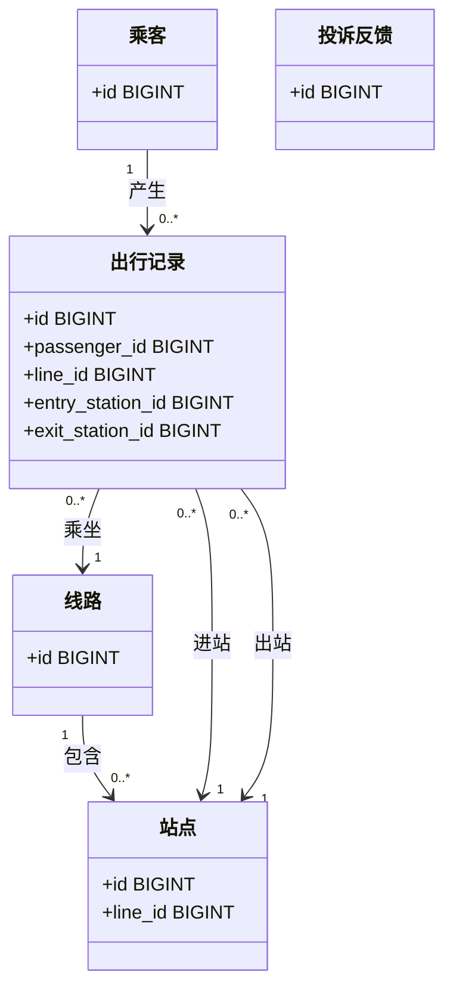

```mermaid
classDiagram
    class 线路 {
        +id BIGINT
    }
    class 站点 {
        +id BIGINT
        +line_id BIGINT
    }
    class 乘客 {
        +id BIGINT
    }
    class 出行记录 {
        +id BIGINT
        +passenger_id BIGINT
        +line_id BIGINT
        +entry_station_id BIGINT
        +exit_station_id BIGINT
    }
    class 投诉反馈 {
        +id BIGINT
    }

    线路 "1" --> "0..*" 站点 : 包含
    乘客 "1" --> "0..*" 出行记录 : 产生
    出行记录 "0..*" --> "1" 线路 : 乘坐
    出行记录 "0..*" --> "1" 站点 : 进站
    出行记录 "0..*" --> "1" 站点 : 出站
```