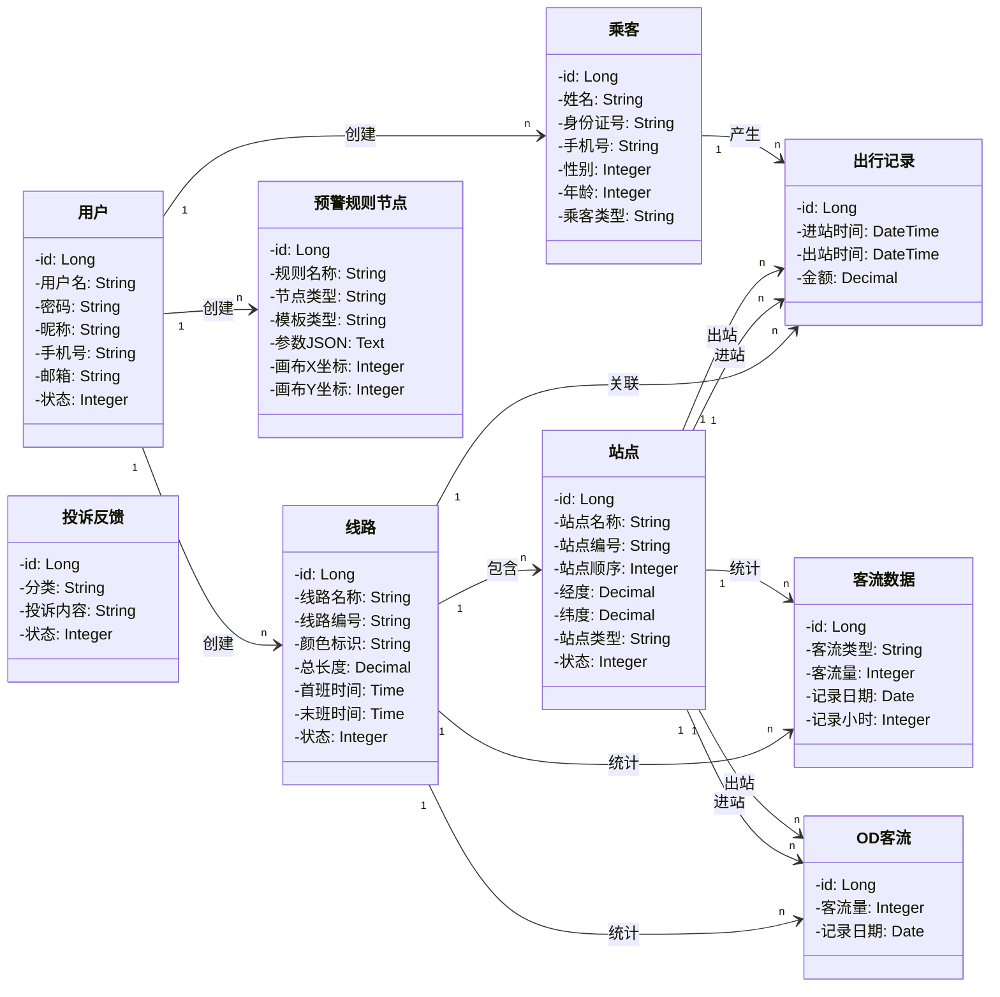

```mermaid
classDiagram
    %% 第一行：系统基础模块
    subgraph 系统基础
        direction LR
        class 用户 {
            -id: Long
            -用户名: String
            -密码: String
            -昵称: String
            -手机号: String
            -邮箱: String
            -状态: Integer
        }
        class 线路 {
            -id: Long
            -线路名称: String
            -线路编号: String
            -颜色标识: String
            -总长度: Decimal
            -首班时间: Time
            -末班时间: Time
            -状态: Integer
        }
        class 站点 {
            -id: Long
            -站点名称: String
            -站点编号: String
            -站点顺序: Integer
            -经度: Decimal
            -纬度: Decimal
            -站点类型: String
            -状态: Integer
        }
    end

    %% 第二行：乘客业务模块
    subgraph 乘客业务
        direction LR
        class 乘客 {
            -id: Long
            -姓名: String
            -身份证号: String
            -手机号: String
            -性别: Integer
            -年龄: Integer
            -乘客类型: String
        }
        class 出行记录 {
            -id: Long
            -进站时间: DateTime
            -出站时间: DateTime
            -金额: Decimal
        }
        class 客流数据 {
            -id: Long
            -客流类型: String
            -客流量: Integer
            -记录日期: Date
            -记录小时: Integer
        }
    end

    %% 第三行：预警与反馈模块
    subgraph 预警与反馈
        direction LR
        class OD客流 {
            -id: Long
            -客流量: Integer
            -记录日期: Date
        }
        class 预警规则节点 {
            -id: Long
            -规则名称: String
            -节点类型: String
            -模板类型: String
            -参数JSON: Text
            -画布X坐标: Integer
            -画布Y坐标: Integer
        }
        class 投诉反馈 {
            -id: Long
            -分类: String
            -投诉内容: String
            -状态: Integer
        }
    end

    %% ------------------ 关系定义（跨子图） ------------------
    用户 "1" --> "n" 线路 : 创建
    用户 "1" --> "n" 乘客 : 创建
    用户 "1" --> "n" 预警规则节点 : 创建

    线路 "1" --> "n" 站点 : 包含
    线路 "1" --> "n" 出行记录 : 关联
    线路 "1" --> "n" 客流数据 : 统计
    线路 "1" --> "n" OD客流 : 统计

    站点 "1" --> "n" 出行记录 : 进站
    站点 "1" --> "n" 出行记录 : 出站
    站点 "1" --> "n" 客流数据 : 统计
    站点 "1" --> "n" OD客流 : 进站
    站点 "1" --> "n" OD客流 : 出站

    乘客 "1" --> "n" 出行记录 : 产生
```